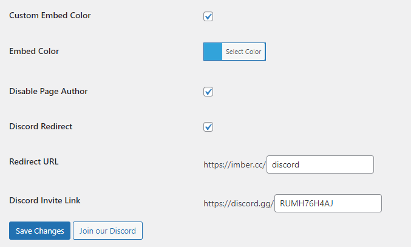

# Imber Tools
 Imber Development Tools WordPress plugin

# How to install?
1. Download "Imber-Tools" as zip.
2. Upload to your WordPress website.
3. Navigate to "Imber Tools" in your admin dashboard

# Features

- Discord embed color changer
- Disable author link from Discord embeds
- Custom Discord invite (site.com/discord)
- Adds support for product restock logs when using the Imber bot

